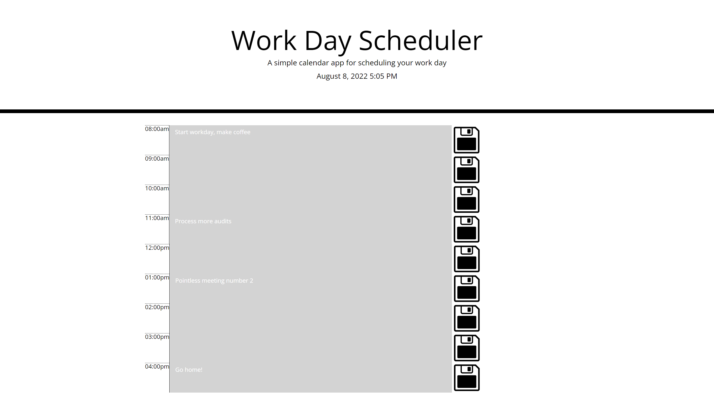

# WorkDayScheduler

## Table of Contents

- [Description](#Description)
- [Link](#Link)
- [Screenshot](#Screenshot)
- [Technologies](#Technologies)
- [User Instructions](#User-Instructions)
- [Contributors](#Contributors)
- [Quesitons](#Questions)

---

## Description

This work day scheduler will allow you to input whatever you want in order to schedule your work day! Got a meeting at 10am? Try typing "meeting about arbitrary statistics" in the 10am section and saving it!

---

## Link

Link to deployed site: https://ryanpjhickey.github.io/WorkDayScheduler/

---

## Screenshot

---

## Technologies

---

## Contributors

---

## Questions?

If you have any questions, please contact me at:
| Name | Github | Email |
| ----------- | ----------- | ----------- |

| Ryan Hickey | [@ryanpjhickey](https://github.com/ryanpjhickey) | ryanpjhickey@gmail.com |

=======
